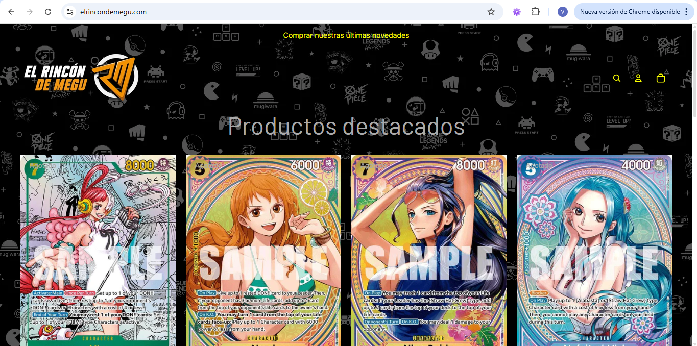
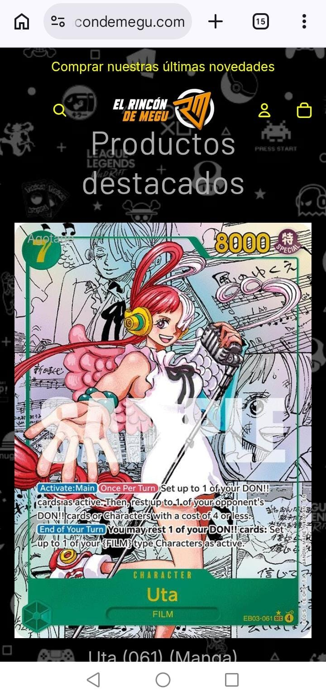
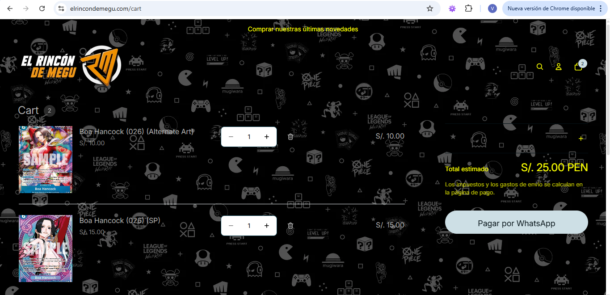
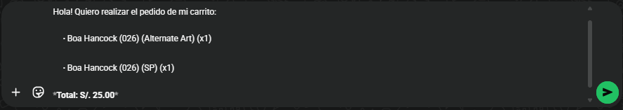

# El Rincón de Megu - E-commerce de Coleccionables (Japón & TCG)

**El Rincón de Megu** es la primera plataforma peruana especializada en la importación y venta de productos exclusivos de Japón, centrada en Trading Card Games (TCG) y figuras de colección. Este proyecto nace con el objetivo de construir una comunidad "geek" que no solo adquiera productos, sino que viva una experiencia de coleccionismo completa.

## Desafíos Técnicos y Soluciones

### 1. Flujo de Venta Personalizado (WhatsApp Commerce)
Debido a la naturaleza del mercado local, se implementó un sistema de **venta asistida por WhatsApp**. El reto consistió en bypassear el checkout tradicional de Shopify manteniendo la funcionalidad del carrito:
* **Lógica en Liquid:** Desarrollé snippets que capturan los objetos globales (`product` y `cart`) y utilizan el filtro `url_param_escape` para generar un mensaje estructurado y legible que se envía directamente al vendedor para cerrar la venta manualmente.
* **Gestión de Inventario Real-Time:** Se configuró una lógica donde, al confirmar el envío del pedido al chat, el sistema descuenta automáticamente el stock mediante la API de Shopify, asegurando la integridad de los datos.

### 2. Frontend & Responsividad Extrema
El diseño visual es crítico para el público coleccionista. Se trabajó con **Shopify CLI** y **Visual Studio Code** para una personalización profunda:
* **Custom CSS:** Se crearon layouts responsivos desde cero para garantizar que las cartas de TCG y los detalles de las figuras se visualicen perfectamente en cualquier dispositivo móvil.
* **Arquitectura Liquid:** Estructuración de colecciones dinámicas:
    * **TCG:** Organizadas por expansiones y sets.
    * **Figuras:** Organizadas por marcas y fabricantes.

### 3. SEO y Visibilidad
Se implementaron configuraciones avanzadas en **Google Search Console** para indexar productos específicos, permitiendo que coleccionistas encuentren piezas exclusivas mediante búsquedas orgánicas en Perú.

## Stack Tecnológico
* **Core:** Shopify Engine.
* **Lenguajes:** Liquid (Templating), CSS3 (Custom Styling), JavaScript (Lógica de carrito y API).
* **Herramientas de Desarrollo:** Shopify CLI, Visual Studio Code, Git.
* **Gestión:** Inventario nativo de Shopify sincronizado con pedidos manuales.

## Estructura del Repositorio

Este repositorio contiene los fragmentos de código más relevantes que demuestran la lógica personalizada aplicada al proyecto:

* **`/assets`**: Contiene el CSS personalizado enfocado en la responsividad móvil y la identidad visual de la tienda (branding).
* **`/snippets`**: Incluye los fragmentos de código Liquid para la integración de WhatsApp y la lógica de captura de datos del carrito.
* **`/screenshots`**: Muestra de la interfaz de usuario y el flujo de mensajes hacia WhatsApp.

## 🖼️ Vista Previa del Proyecto

A continuación se muestra el flujo de usuario y la interfaz responsiva implementada en **El Rincón de Megu**:

### 🖥️ Vista de Ordenador (Desktop)
En esta vista se puede apreciar el fondo personalizado y la disposición de los productos destacados con el branding de la tienda.
 

---

### 📱 Vista Dispositivos Móviles (Mobile)
Optimización del layout para una navegación fluida en celulares, priorizando la visualización de los detalles en las cartas y figuras.
 

---

### 🛒 Gestión de Carrito de Compras
Interfaz del carrito donde se acumulan los ítems antes de proceder al cierre de venta por WhatsApp.
 

---

### 💬 Finalización de Compra (Mensaje WhatsApp)
Resultado final de la lógica Liquid: un mensaje estructurado con la lista de productos, cantidades y el monto total enviado directamente al vendedor.
 

> *Nota: Se priorizó un diseño responsivo para facilitar la compra rápida de productos TCG desde dispositivos móviles.*

## 📈 Roadmap de Innovación
El proyecto está diseñado para escalar hacia un ecosistema digital más robusto:
1.  **Gamificación de Colecciones:** Implementación de perfiles de usuario donde los clientes podrán mostrar sus colecciones.
2.  **Sistema de Recompensas:** Integración de una base de datos externa para otorgar beneficios y regalos automáticos al completar sets específicos (Master Sets).
3.  **App Móvil:** Desarrollo de una aplicación dedicada para mejorar la interacción de la comunidad.

---
*Desarrollado con enfoque en la experiencia del usuario y la pasión por el coleccionismo.*